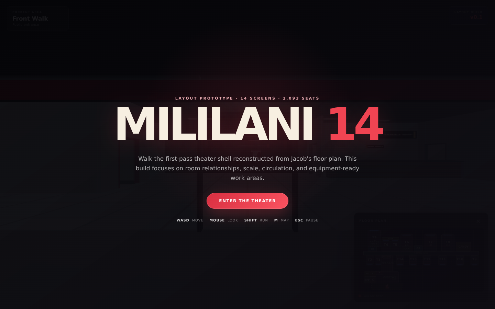

# Mililani 14 Theater Simulator



A first-person, browser-based layout prototype for a multiplayer movie-theater simulator. This first build reconstructs the relationship and approximate scale of the Consolidated Theatres Mililani 14 from a hand-drawn employee floor plan, public location details, and visual references.

This is a spatial prototype—not an official measured architectural plan. It is unaffiliated with Consolidated Theatres.

## What is in v0.1

- A walkable entrance, lobby, lobby approach, ticket checkpoint, and long auditorium hall
- All 14 stadium-style auditoriums with 1,093 procedurally placed seats
- Matching footprint families for Theaters 1/2, 4/5, 3/6/7/8, and 9–14
- Concession backline, bar, kitchen, kitchen storage, office, box office, candy storage, and both restrooms
- Restroom stalls, sinks, and urinals placed from the sketch
- Detail-ready placeholders and stable IDs for the popper, soda fountains, grill, fryer, turbo oven, and bar well
- Dashed lower-storage volumes on the map, including the dotted usher/soda stock area
- Desktop first-person controls, touch controls, collision, stadium aisle elevations, and a live floor-plan minimap
- Procedural materials, original island-botanical lobby art, room signs, screens, acoustic panels, and instanced seating

The exact capacities represented are: 38 seats each in Theaters 1–2; 148 in 3; 58 each in 4–5; 148, 153, and 152 in 6–8; and 50 each in 9–14.

## Controls

| Input | Action |
| --- | --- |
| `W A S D` | Move |
| Mouse | Look |
| `Shift` | Run |
| `M` | Show or hide the map |
| `R` | Return to the entrance |
| `Esc` | Pause / release mouse |

Touch devices get a movement stick, drag-to-look, and hold-to-run button.

## Run locally

Requires Node.js 24 or a current compatible Node release.

```bash
npm install
npm run dev
```

Validation and production build:

```bash
npm test
npm run build
```

`npm test` protects the 14-theater grouping, exact 1,093-seat total, room IDs, bounds, and equipment anchors. GitHub Actions runs the same checks and deploys the built `dist` directory after changes reach `main` once the repository's Pages source is set to **GitHub Actions**.

## Layout decisions and current limits

See [docs/layout-notes.md](docs/layout-notes.md) for the sketch translation, coordinate plan, known ambiguities, and the most useful measurements or corrections for the next pass.

This version deliberately stops at the spatial shell. It does not yet implement shifts, guests, orders, cleaning, closing tasks, or multiplayer networking. Equipment anchors and player state are separated from presentation so those systems can be added without rebuilding the floor plan.
